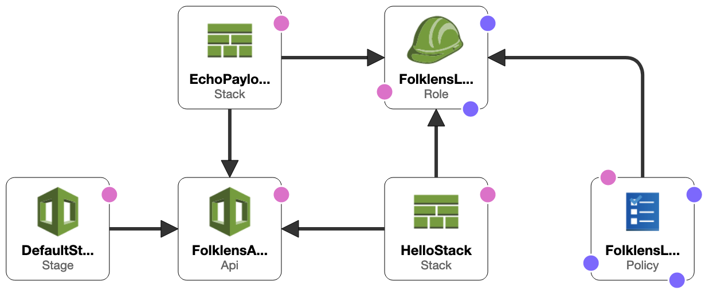

# folklens-aws
Use CloudFormation to create the AWS resources needed to call a Lambda function via HTTP.

## Commands

### Create stack

```bash
$ aws cloudformation create-stack --stack-name folklens --template-body file://folklens-stack.json --capabilities CAPABILITY_IAM
```

### View the result

View https://{API ID}.execute-api.{REGION}.amazonaws.com/echo-payload in a browser to see output like:

```json
{
  "version": "2.0",
  "routeKey": "GET /echo-payload",
  "rawPath": "/echo-payload",
  "rawQueryString": "",
  "headers": {
    "accept": "text/html,application/xhtml+xml,application/xml;q=0.9,image/webp,*/*;q=0.8",
    "accept-encoding": "gzip, deflate, br",
    "accept-language": "en-GB,en;q=0.5",
    "cache-control": "max-age=0",
    "content-length": "0",
    "host": "bwqhy9pjha.execute-api.eu-west-2.amazonaws.com",
    "sec-fetch-dest": "document",
    "sec-fetch-mode": "navigate",
    "sec-fetch-site": "none",
    "sec-fetch-user": "?1",
    "upgrade-insecure-requests": "1",
    "user-agent": "Mozilla/5.0 (Macintosh; Intel Mac OS X 10.15; rv:91.0) Gecko/20100101 Firefox/91.0",
    "x-amzn-trace-id": "Root=1-61a8ffc7-16be421302f3c9bd544da49c",
    "x-forwarded-for": "86.0.177.241",
    "x-forwarded-port": "443",
    "x-forwarded-proto": "https"
  },
  "requestContext": {
    "accountId": "995695795345",
    "apiId": "bwqhy9pjha",
    "domainName": "bwqhy9pjha.execute-api.eu-west-2.amazonaws.com",
    "domainPrefix": "bwqhy9pjha",
    "http": {
      "method": "GET",
      "path": "/echo-payload",
      "protocol": "HTTP/1.1",
      "sourceIp": "86.0.177.241",
      "userAgent": "Mozilla/5.0 (Macintosh; Intel Mac OS X 10.15; rv:91.0) Gecko/20100101 Firefox/91.0"
    },
    "requestId": "JuznRjHOLPEEMRA=",
    "routeKey": "GET /echo-payload",
    "stage": "$default",
    "time": "02/Dec/2021:17:17:59 +0000",
    "timeEpoch": 1638465479939
  },
  "isBase64Encoded": false
}
```

### Delete stack

```bash
$ aws cloudformation delete-stack --stack-name folklens
```

## Stack Visualisation 

